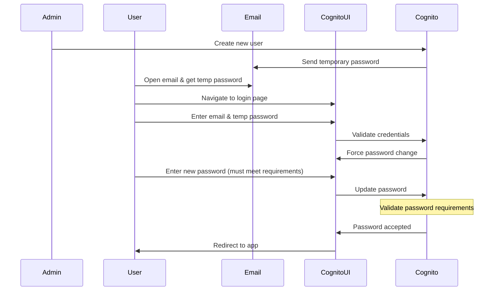
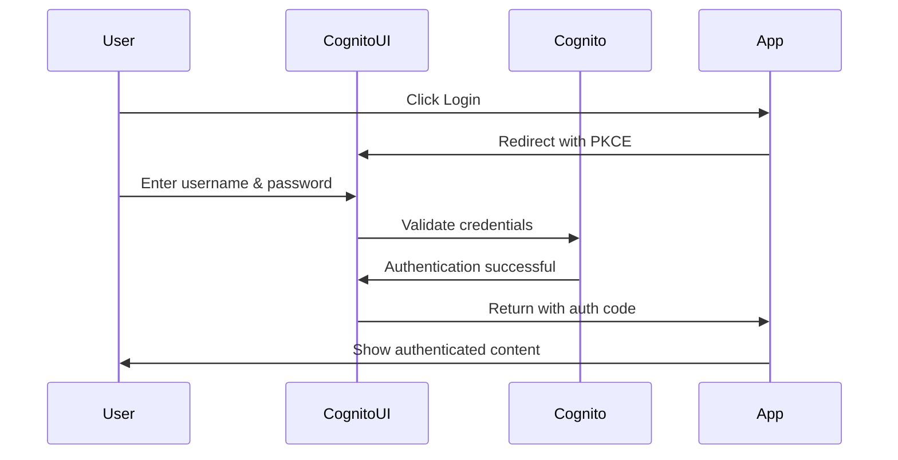
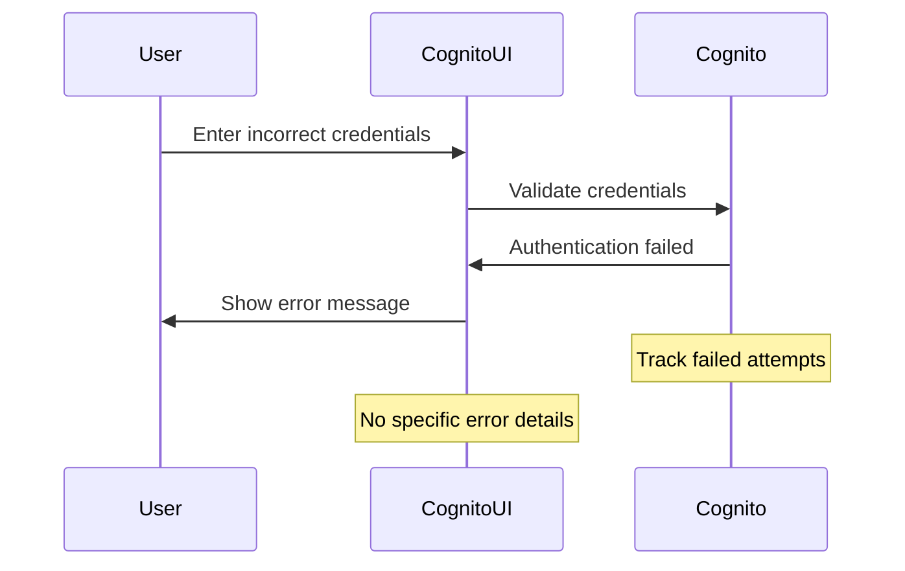
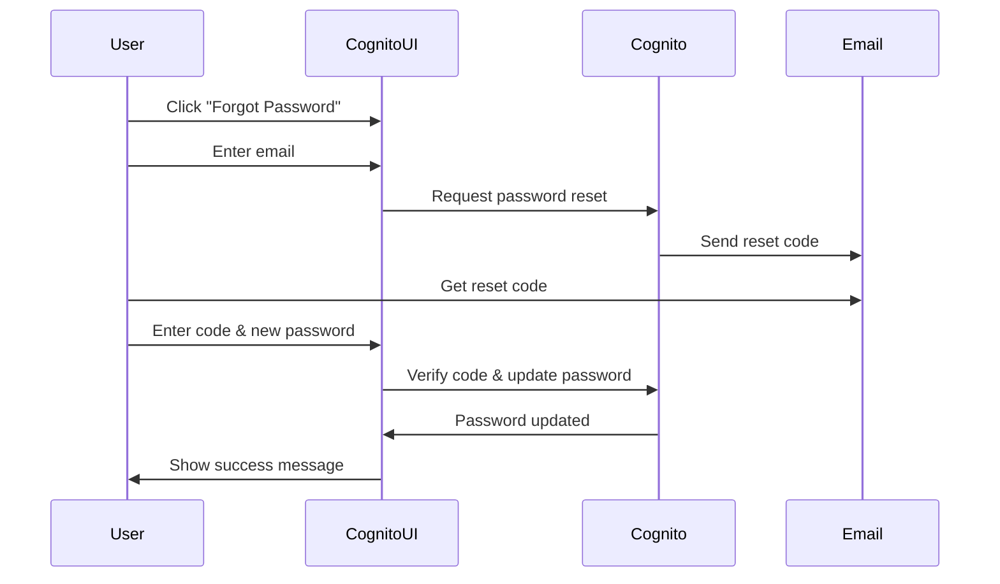

# Cognito Managed Login User Interaction Flows

## 1. New User First-Time Login Flow



Security Considerations:
- Temporary password expires after 24 hours
- New password must meet complexity requirements
- Email link security
- Secure password transmission

## 2. Normal User Login Flow



Security Considerations:
- PKCE protection
- Rate limiting
- Secure session handling
- Token management

## 3. Invalid Credentials Flow



Security Considerations:
- Generic error messages
- Account lockout after X attempts
- Brute force protection
- No username enumeration

## 4. Password Reset Flow



Security Considerations:
- Reset code expiration
- Rate limiting reset requests
- Secure email delivery
- Password requirements enforcement

## Security Best Practices

### Password Requirements
- Minimum length: 8 characters
- Must contain:
  * Uppercase letters
  * Lowercase letters
  * Numbers
  * Special characters
- Cannot be same as previous X passwords

### Account Protection
1. Failed Login Attempts:
   - Temporary lockout after X failures
   - Increasing lockout duration
   - Admin notification of lockouts

2. Password Reset Security:
   - Limited-time reset codes
   - Single-use codes
   - Rate limiting of reset requests
   - Secure email delivery

3. Session Management:
   - Secure token handling
   - Session timeouts
   - Concurrent session handling
   - Device tracking

## Error Messages

### Best Practices
- Generic error messages
- No username enumeration
- No password requirement hints
- Clear user guidance

### Example Messages:
```
Login Error:
"The username or password is incorrect"
(Not: "This username doesn't exist")

Password Requirements:
"Your password doesn't meet the requirements"
(Not: "Your password needs a number")

Account Lockout:
"Please try again later or contact support"
(Not: "Account locked for 30 minutes")
```

## User Experience Considerations

### Accessibility
- Clear error messages
- Keyboard navigation
- Screen reader support
- High contrast options

### Mobile Support
- Responsive design
- Touch-friendly inputs
- Clear input fields
- Mobile-optimized layouts

## Testing Checklist

### Functional Testing
- [ ] New user flow
- [ ] Normal login
- [ ] Password reset
- [ ] Invalid credentials
- [ ] Account lockout

### Security Testing
- [ ] Password requirements
- [ ] Rate limiting
- [ ] Session handling
- [ ] Token management
- [ ] Error messages

### Integration Testing
- [ ] Email delivery
- [ ] App redirects
- [ ] Token handling
- [ ] Error handling
