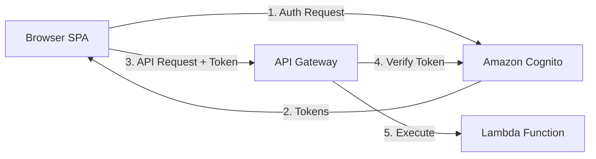
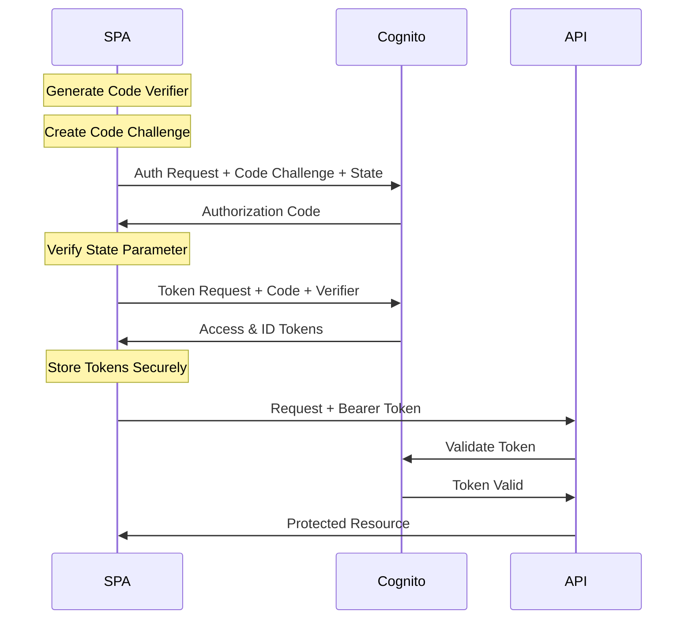
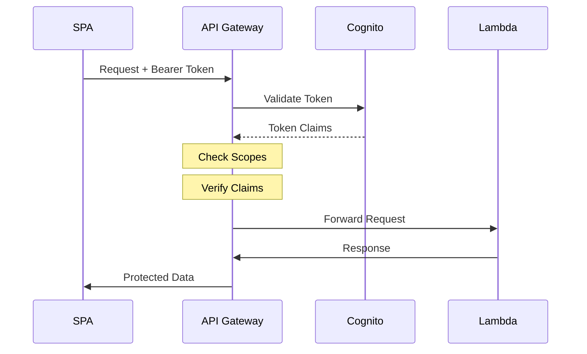

# Demonstration for using a Secure Serverless Web Application.

## The Purpose of this repo is to demonstrate a website with an API Gateway that implements best practices for a modern SPA in AWS.  It highlights AWS Cognito authentication & authorization security measures used. 
Understanding the Security Flow between Client, Cognito, and API Gateway

### Table of Contents
1. [Overview](#overview)
2. [Component Interaction Security](#component-interaction-security)
3. [Authentication Flow](#authentication-flow)
4. [Authorization Flow](#authorization-flow)
5. [Security Considerations](#security-considerations)
6. [Common Vulnerabilities & Mitigations](#common-vulnerabilities--mitigations)

## Overview

This guide details the secure interaction between three key components:
- Browser-based SPA (Single Page Application)
- Amazon Cognito (Authentication/Identity Provider)
- API Gateway (Protected Resources)



## Component Interaction Security

### 1. SPA to Cognito Communication
- Always HTTPS
- PKCE protection for authorization code
- State parameter for CSRF protection
- No client secrets in browser code

### 2. Token Handling
- Access tokens stored in sessionStorage only
- ID tokens contain user identity
- Tokens never exposed in URLs
- Tokens cleared on session end

### 3. API Authorization
- Bearer token in Authorization header
- Token validation by API Gateway
- Proper CORS configuration
- Rate limiting implementation

## Authentication Flow

Detailed sequence of the PKCE-protected OAuth 2.0 flow:



Key Security Points:
1. Code Verifier Generation
   - Cryptographically random
   - 128 bytes minimum length
   - Base64URL encoded
   - Single use only

2. Code Challenge Creation
   - SHA-256 hash of verifier
   - Base64URL encoded
   - Prevents code injection
   - Verifiable by Cognito

3. State Parameter
   - CSRF protection
   - Random per request
   - Validated before token acceptance
   - Prevents replay attacks

## Authorization Flow

API Gateway authorization process:



Security Considerations:
1. Token Validation
   - Signature verification
   - Expiration check
   - Scope validation
   - Issuer verification

2. API Gateway Protection
   - Cognito authorizer
   - Request validation
   - Response security
   - Error handling

3. Lambda Security
   - Input validation
   - Principle of least privilege
   - Secure error responses
   - Logging and monitoring

## Security Considerations

### Token Security
1. Access Token
   - Short lifetime (1 hour max)
   - Never stored persistently
   - Never logged or exposed
   - Used only for API access

2. ID Token
   - Contains user identity
   - Never sent to API
   - Used for user info only
   - Validated signature

3. Refresh Token
   - Not used in SPA
   - Security risk in browser
   - Use re-authentication instead
   - Clear on logout

### CORS Security
```json
{
    "Access-Control-Allow-Origin": "https://your-domain.com",
    "Access-Control-Allow-Methods": "OPTIONS,POST",
    "Access-Control-Allow-Headers": "Authorization,Content-Type"
}
```

Key Points:
- Specific origins only
- Minimum required methods
- Required headers only
- No credentials in CORS

## Common Vulnerabilities & Mitigations

### 1. Token Theft Prevention
- Use sessionStorage only
- Clear on page close
- Secure token transmission
- Monitor for abuse

### 2. CSRF Protection
- State parameter validation
- Proper CORS setup
- Token-based auth
- No cookie auth

### 3. Code Injection Prevention
- PKCE implementation
- Input validation
- Output encoding
- CSP headers

### 4. XSS Protection
```http
Content-Security-Policy: default-src 'self';
X-Frame-Options: DENY;
X-Content-Type-Options: nosniff;
```

## Implementation Checklist

Security Critical:
- [ ] PKCE implementation complete
- [ ] Secure token storage configured
- [ ] CORS properly set up
- [ ] Error handling secure
- [ ] Logging implemented
- [ ] Monitoring in place

Additional Considerations:
- [ ] Rate limiting
- [ ] DDoS protection
- [ ] Audit logging
- [ ] Incident response
- [ ] Security headers
- [ ] SSL/TLS configuration

## Testing Security

### Authentication Testing
1. PKCE Verification
   - Code verifier randomness
   - Challenge creation
   - State parameter validation
   - Token handling

2. Authorization Testing
   - Token validation
   - Scope checking
   - API access control
   - Error responses

3. Security Testing
   - CORS validation
   - XSS prevention
   - CSRF protection
   - Token storage

## Monitoring and Alerts

Security events to monitor:
1. Authentication failures
2. Token validation errors
3. CORS violations
4. Rate limit breaches
5. Unauthorized API attempts
6. Token misuse

Alert on:
- Multiple auth failures
- Token validation spikes
- Unusual traffic patterns
- CORS violations
- API abuse attempts

## References

1. OAuth 2.0 Security:
   - [RFC 6749](https://tools.ietf.org/html/rfc6749)
   - [RFC 7636](https://tools.ietf.org/html/rfc7636) (PKCE)
   - [OAuth 2.0 Security Best Practices](https://tools.ietf.org/html/draft-ietf-oauth-security-topics)

2. OIDC Resources:
   - [OpenID Connect Core](https://openid.net/specs/openid-connect-core-1_0.html)
   - [OIDC Security Considerations](https://openid.net/specs/openid-connect-security-1_0.html)

3. AWS Documentation:
   - [Cognito Developer Guide](https://docs.aws.amazon.com/cognito)
   - [API Gateway Security](https://docs.aws.amazon.com/apigateway)
